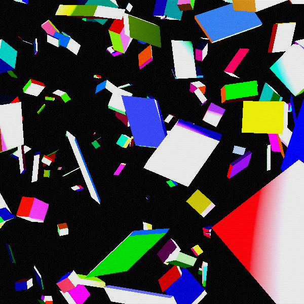
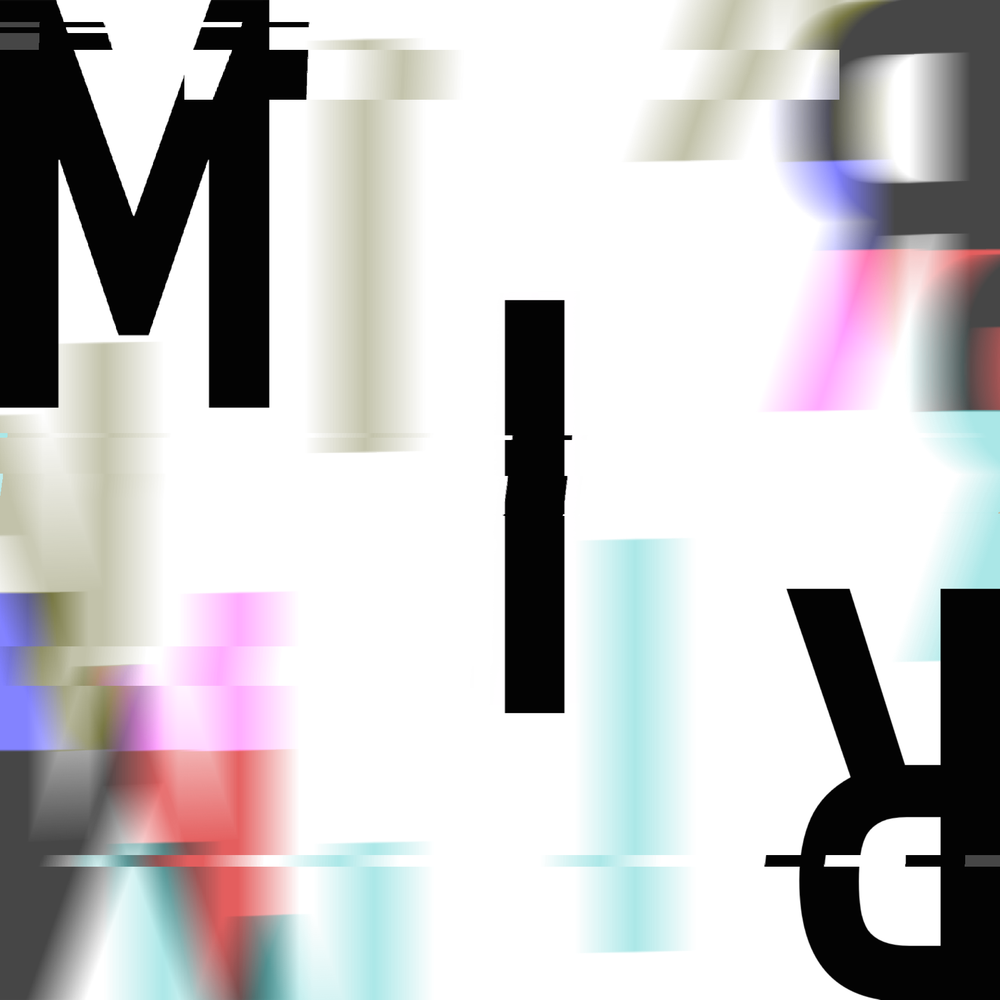

## 

  

# MAJORS

  

# EXPERIENCES 

| What | Where | When |
| - | - | - |
| Windows App Developer  | NEXCAM Co., Ltd.| 25.05 ~ |  
| B.S. in Computer Engineering | Incheon National University | 17.03 ~ 23.08 |
  
# PROJECTS

| White ashes (OpenGL; 25.01) |
| - |
|  |
| MIR Engine 0.1 (SFML; 24.08 ~ 24.12) |
|  |

---

