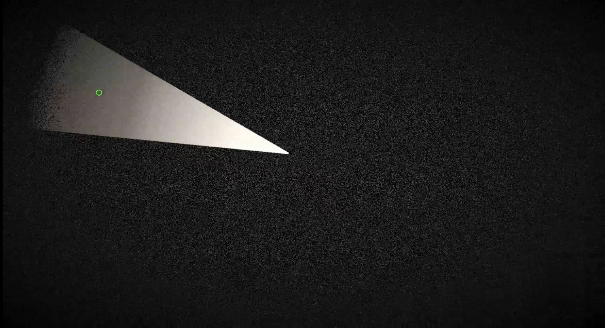
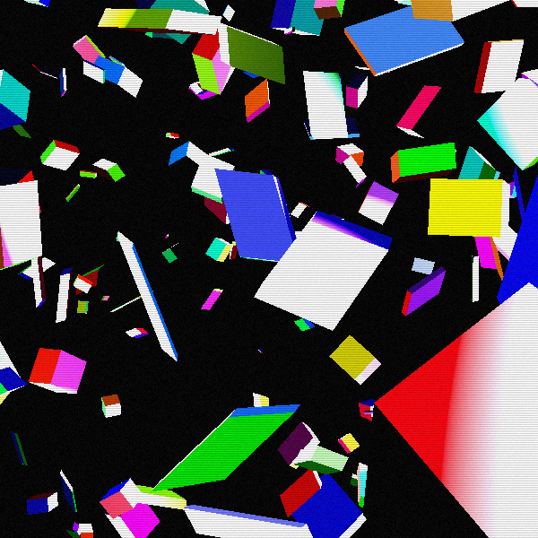
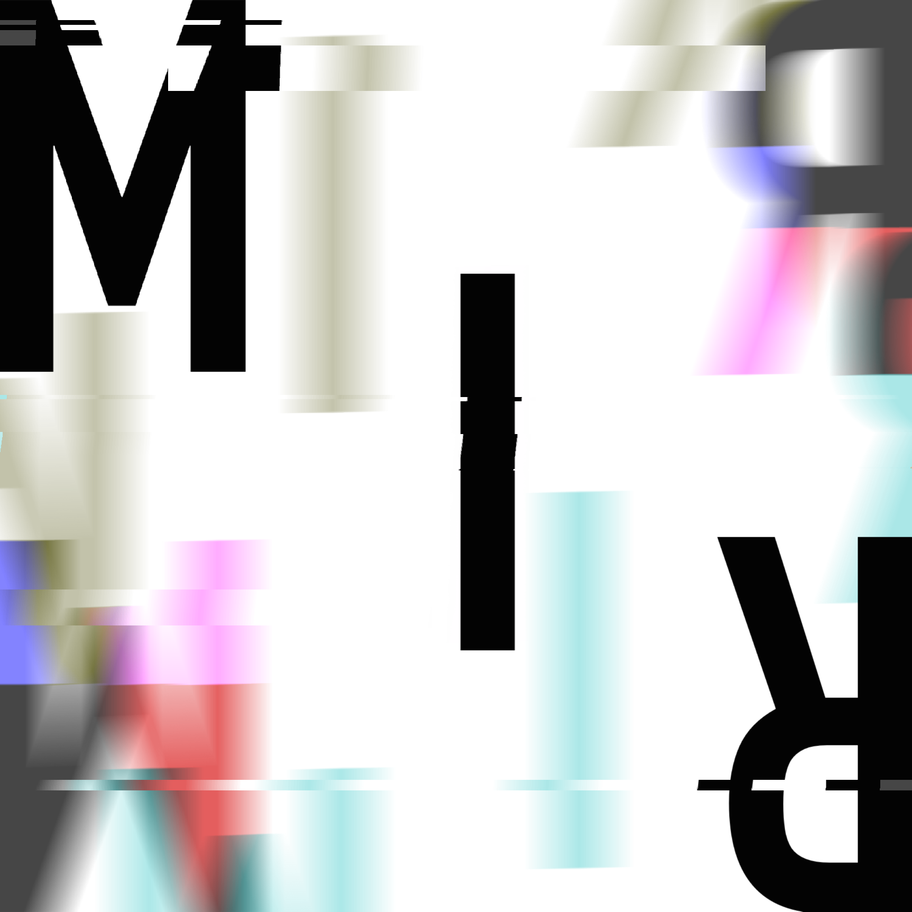

#### Skills
    .NET/C++ Development (Visual Studio)
    Cross-Platform Applications (C/C++ using CMake / XMake) 
    Custom Automation tools (Python)
    Shader Programming (GLSL / HLSL)

#### Experiences
    Windows Application Engineer in NEXCAM Co., Ltd. (May 2025 – Present)
    B.S. in Computer Engineering at Incheon National University (Mar 2017 – Aug 2023)

#### Interests
    Real Time Computer Graphics
    Game Programming / Engine
    Computer Vision

---
    

  
### P R O J E C T S  
  <table>
    <tbody>
      <tr>
        <td></td>
        <td></td>
        <td></td>
      </tr>
    </tbody>
  </table>

---

> _For more info, please visit [my blog.](https://g1rmmr.github.io/)_

